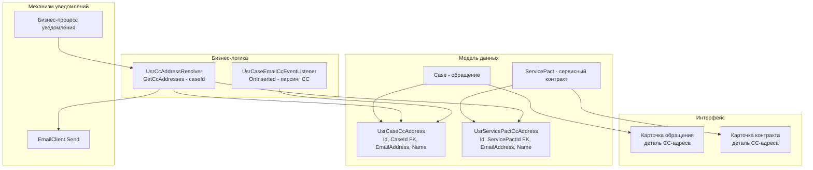
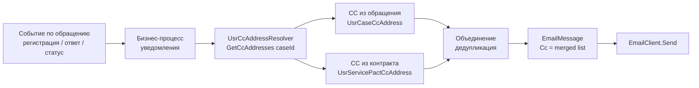

# BPMSoft: Доработка CC-адресов в email-уведомлениях по обращениям

**Дата:** 2026-03-26
**Статус:** В планировании

---

## 1. Контекст задачи

Система BPMSoft отправляет email-уведомления по обращениям (регистрация, ответ, изменение статуса и т.д.) только контакту, открывшему обращение, и назначенному инженеру.

**Требуется:**
1. Возможность добавлять дополнительные CC-адреса на уровне **сервисного контракта** (ServicePact) — для всех обращений по контракту
2. Возможность добавлять дополнительные CC-адреса на уровне **обращения** (Case) — вручную или автоматически из заголовка CC входящего email

---

## 2. Анализ существующей архитектуры

### 2.1 Технологический стек

| Слой | Технология |
|---|---|
| Backend | C# / .NET Framework 4.7.2 / .NET Standard 2.0 |
| ORM / Query Builder | BPMSoft.Core.DB (`Select`, `DBExecutor`) |
| DI / IoC | `ClassFactory`, `[DefaultBinding]`, `ConstructorArgument` |
| Entity Events | `[EntityEventListener(SchemaName = "...")]` |
| Email отправка | `IEmailClient` → `EmailClient` / `ExchangeClient` |
| Frontend | Angular + Angular Elements, Webpack, RequireJS |

### 2.2 Механизм отправки email

Email отправляется через два клиента:
- [`IntegrationV2/EmailClient.cs`](../bpmsoft/BPMSoft.Configuration/Pkg/IntegrationV2/Files/cs/EmailClient.cs) — SMTP/IMAP
- [`Exchange/ExchangeClient.cs`](../bpmsoft/BPMSoft.Configuration/Pkg/Exchange/Files/cs/EmailSend/ExchangeClient.cs) — Microsoft Exchange

Оба принимают объект `EmailMessage` с коллекцией `Cc`. Метод `SetRecipients()` в `ExchangeClient` уже поддерживает `CcRecipients` — нужно только передать адреса.

### 2.3 Существующие кастомные схемы (пакет Custom)

| Схема | Описание |
|---|---|
| `ServicePact` | Замещение стандартной схемы сервисного контракта |
| `ServiceItem` | Сервисная услуга |
| `ConfItem` | Конфигурационная единица |
| `UsrConfIteminService` | Связь конф. единицы и сервиса |

### 2.4 Ключевые зависимости (из OpenIdAuth.csproj)

```
BPMSoft.Common
BPMSoft.Core
BPMSoft.Core.DB
BPMSoft.Core.Entities
BPMSoft.Core.Factories
BPMSoft.Nui.ServiceModel
BPMSoft.Web.Common
```

---

## 3. Архитектура решения

### 3.1 Диаграмма компонентов



### 3.2 Поток данных при отправке уведомления



---

## 4. Детальный план реализации

### Шаг 1 — Исследование механизма уведомлений ⚠️ КРИТИЧНО

**Цель:** Найти точку входа, где формируется `EmailMessage` для уведомлений по обращениям.

**Действия:**
- Найти бизнес-процессы с именами типа `CaseNotification`, `CaseEmailNotification` в дизайнере процессов BPMSoft (раздел "Процессы")
- Найти C#-классы, реализующие отправку уведомлений по обращениям (поиск по `Case` + `EmailClient` или `IEmailClient`)
- Определить, где формируется список получателей (`To`, `Cc`) в этих уведомлениях

**Риск:** Если уведомления реализованы через BPMN-процессы (не C#), интеграция CC будет через Script Task в процессе, а не через замещение C#-класса.

---

### Шаг 2 — Создание схемы `UsrCaseCcAddress`

**Расположение:** `Pkg/Custom/Schemas/UsrCaseCcAddress/`

**Структура таблицы:**

| Колонка | Тип | Описание |
|---|---|---|
| `Id` | Guid | PK, автогенерация |
| `CaseId` | Guid (FK → Case) | Ссылка на обращение |
| `EmailAddress` | Text(250) | Email-адрес для CC |
| `Name` | Text(250) | Отображаемое имя (опционально) |
| `CreatedOn` | DateTime | Дата создания |
| `ModifiedOn` | DateTime | Дата изменения |
| `CreatedById` | Guid (FK → Contact) | Кто создал |
| `ModifiedById` | Guid (FK → Contact) | Кто изменил |

**Файлы для создания:**
- `descriptor.json` — описание схемы
- `metadata.json` — метаданные (UId, родительская схема `BaseEntity`)
- `properties.json` — свойства схемы

---

### Шаг 3 — Создание схемы `UsrServicePactCcAddress`

**Расположение:** `Pkg/Custom/Schemas/UsrServicePactCcAddress/`

**Структура таблицы:**

| Колонка | Тип | Описание |
|---|---|---|
| `Id` | Guid | PK, автогенерация |
| `ServicePactId` | Guid (FK → ServicePact) | Ссылка на сервисный контракт |
| `EmailAddress` | Text(250) | Email-адрес для CC |
| `Name` | Text(250) | Отображаемое имя (опционально) |
| `CreatedOn` | DateTime | Дата создания |
| `ModifiedOn` | DateTime | Дата изменения |
| `CreatedById` | Guid (FK → Contact) | Кто создал |
| `ModifiedById` | Guid (FK → Contact) | Кто изменил |

---

### Шаг 4 — UI: Деталь на карточке обращения

**Расположение:** `Pkg/Custom/Schemas/UsrCaseCcAddressDetail/`

Стандартная деталь BPMSoft (схема страницы детали) для управления CC-адресами обращения.

**Действия:**
- Создать схему детали `UsrCaseCcAddressDetail` (тип: `Detail`)
- Создать замещение страницы `CasePageV2` для добавления детали на вкладку (например, "Дополнительно")
- Колонки в детали: `EmailAddress`, `Name`

---

### Шаг 5 — UI: Деталь на карточке сервисного контракта

**Расположение:** `Pkg/Custom/Schemas/UsrServicePactCcAddressDetail/`

Аналогичная деталь для `ServicePact`.

**Действия:**
- Создать схему детали `UsrServicePactCcAddressDetail`
- Создать замещение страницы `ServicePactPage` для добавления детали

---

### Шаг 6 — C#-сервис `UsrCcAddressResolver`

**Расположение:** `Pkg/Custom/Schemas/UsrCcAddressResolver/UsrCcAddressResolver.cs`

```csharp
namespace BPMSoft.Configuration.Custom
{
    using System;
    using System.Collections.Generic;
    using System.Data;
    using BPMSoft.Core;
    using BPMSoft.Core.DB;
    using BPMSoft.Core.Factories;
    using BPMSoft.Common;

    public interface IUsrCcAddressResolver {
        IEnumerable<string> GetCcAddresses(Guid caseId);
    }

    [DefaultBinding(typeof(IUsrCcAddressResolver))]
    public class UsrCcAddressResolver : IUsrCcAddressResolver {

        private readonly UserConnection _userConnection;

        public UsrCcAddressResolver(UserConnection userConnection) {
            _userConnection = userConnection;
        }

        public IEnumerable<string> GetCcAddresses(Guid caseId) {
            var result = new HashSet<string>(StringComparer.OrdinalIgnoreCase);

            // 1. CC из обращения
            CollectCaseCcAddresses(caseId, result);

            // 2. Получить ServicePactId из Case
            var servicePactId = GetServicePactId(caseId);
            if (servicePactId != Guid.Empty) {
                // 3. CC из контракта
                CollectServicePactCcAddresses(servicePactId, result);
            }

            return result;
        }

        private void CollectCaseCcAddresses(Guid caseId, HashSet<string> result) {
            var select = new Select(_userConnection)
                .Column("EmailAddress")
                .From("UsrCaseCcAddress")
                .Where("CaseId").IsEqual(Column.Parameter(caseId)) as Select;
            ReadEmailAddresses(select, result);
        }

        private Guid GetServicePactId(Guid caseId) {
            // SELECT ServicePactId FROM Case WHERE Id = @caseId
            // Вернуть Guid.Empty если не найдено
        }

        private void CollectServicePactCcAddresses(Guid servicePactId, HashSet<string> result) {
            var select = new Select(_userConnection)
                .Column("EmailAddress")
                .From("UsrServicePactCcAddress")
                .Where("ServicePactId").IsEqual(Column.Parameter(servicePactId)) as Select;
            ReadEmailAddresses(select, result);
        }

        private void ReadEmailAddresses(Select select, HashSet<string> result) {
            using (DBExecutor dbExecutor = _userConnection.EnsureDBConnection()) {
                using (IDataReader reader = select.ExecuteReader(dbExecutor)) {
                    while (reader.Read()) {
                        var email = reader.GetColumnValue<string>("EmailAddress");
                        if (!string.IsNullOrWhiteSpace(email)) {
                            result.Add(email.Trim());
                        }
                    }
                }
            }
        }
    }
}
```

---

### Шаг 7 — Интеграция CC в механизм уведомлений

**Зависит от результата Шага 1.**

#### Вариант А: Уведомления через C#-класс

Найти класс, формирующий `EmailMessage`, и добавить:

```csharp
// Внедрить IUsrCcAddressResolver через ClassFactory
var ccResolver = ClassFactory.Get<IUsrCcAddressResolver>(
    new ConstructorArgument("userConnection", _userConnection));
var ccAddresses = ccResolver.GetCcAddresses(caseId);

// Добавить в EmailMessage
foreach (var cc in ccAddresses) {
    emailMessage.Cc.Add(cc);
}
```

#### Вариант Б: Уведомления через BPMN-процесс

Добавить в процесс Script Task перед элементом "Отправить email":

```csharp
// Script Task в BPMN-процессе
var ccResolver = ClassFactory.Get<IUsrCcAddressResolver>(
    new ConstructorArgument("userConnection", UserConnection));
var ccList = string.Join(";", ccResolver.GetCcAddresses(CaseId));
// Передать ccList в параметр CC элемента "Отправить email"
```

---

### Шаг 8 — Парсинг CC из входящего email

**Расположение:** `Pkg/Custom/Schemas/UsrCaseEmailCcEventListener/UsrCaseEmailCcEventListener.cs`

```csharp
namespace BPMSoft.Configuration.Custom
{
    using BPMSoft.Core.Entities;
    using BPMSoft.Core.Entities.Events;
    using BPMSoft.Core.Factories;

    [EntityEventListener(SchemaName = "Case")]
    public class UsrCaseEmailCcEventListener : BaseEntityEventListener {

        public override void OnInserted(object sender, EntityAfterEventArgs e) {
            base.OnInserted(sender, e);
            var caseEntity = (Entity)sender;
            var userConnection = caseEntity.UserConnection;

            // 1. Получить ActivityId (входящее письмо) из обращения
            // Поле: SourceActivityId или аналогичное
            var activityId = caseEntity.GetTypedColumnValue<Guid>("SourceActivityId");
            if (activityId == Guid.Empty) return;

            // 2. Прочитать CC из Activity
            // Таблица ActivityParticipant или поле CopyRecipients в Activity
            var ccAddresses = GetCcFromActivity(userConnection, activityId);

            // 3. Сохранить в UsrCaseCcAddress
            var caseId = caseEntity.GetTypedColumnValue<Guid>("Id");
            SaveCcAddresses(userConnection, caseId, ccAddresses);
        }

        private IEnumerable<string> GetCcFromActivity(UserConnection uc, Guid activityId) {
            // SELECT Email FROM ActivityParticipant
            // WHERE ActivityId = @activityId AND RoleId = <CC_ROLE_ID>
            // или читать из поля Activity.CopyRecipients
        }

        private void SaveCcAddresses(UserConnection uc, Guid caseId, IEnumerable<string> emails) {
            foreach (var email in emails) {
                var entity = uc.EntitySchemaManager
                    .GetInstanceByName("UsrCaseCcAddress")
                    .CreateEntity(uc);
                entity.SetDefColumnValues();
                entity.SetColumnValue("CaseId", caseId);
                entity.SetColumnValue("EmailAddress", email);
                entity.Save();
            }
        }
    }
}
```

**⚠️ Риск:** Нужно уточнить, в каком поле/таблице BPMSoft хранит CC входящего письма. Возможные варианты:
- `ActivityParticipant` с ролью "CC"
- Поле `CopyRecipients` в схеме `Activity`
- Кастомное поле, добавленное при интеграции email

---

### Шаг 9 — Тесты

**Расположение:** `Pkg/Custom/Schemas/UsrCcAddressResolverTests/`

Unit-тесты для `UsrCcAddressResolver`:

| Тест | Описание |
|---|---|
| `GetCcAddresses_CaseHasCc_ReturnsCaseCc` | CC только из обращения |
| `GetCcAddresses_PactHasCc_ReturnsPactCc` | CC только из контракта |
| `GetCcAddresses_BothHaveCc_ReturnsMergedDeduped` | CC из обращения + контракта, дедупликация |
| `GetCcAddresses_NoCcAnywhere_ReturnsEmpty` | Нет CC нигде — пустой список |
| `GetCcAddresses_NoPact_ReturnsOnlyCaseCc` | Обращение без контракта |

---

### Шаг 10 — Регистрация в пакете Custom

**Файлы для обновления:**
- `Pkg/Custom/descriptor.json` — добавить зависимости от `CaseService`, `ServiceModel`
- Все новые схемы должны быть в папке `Pkg/Custom/Schemas/`

**Порядок установки схем в БД:**
1. `UsrCaseCcAddress` (нет зависимостей кроме `Case`)
2. `UsrServicePactCcAddress` (нет зависимостей кроме `ServicePact`)
3. `UsrCcAddressResolver` (зависит от схем выше)
4. `UsrCaseEmailCcEventListener` (зависит от `UsrCaseCcAddress`)
5. UI-детали (зависят от схем данных)

---

## 5. Риски и открытые вопросы

| # | Риск | Вероятность | Митигация |
|---|---|---|---|
| 1 | Механизм уведомлений реализован через BPMN, а не C# | Высокая | Исследовать на Шаге 1, адаптировать Шаг 7 |
| 2 | CC входящего email хранится в нестандартном месте | Средняя | Исследовать схему `Activity` и `ActivityParticipant` |
| 3 | `ServicePact` — замещение стандартной схемы, FK может конфликтовать | Низкая | Проверить UId родительской схемы в metadata.json |
| 4 | Дублирование CC при повторных уведомлениях | Низкая | Дедупликация в `UsrCcAddressResolver` через `HashSet` |

---

## 6. Открытые вопросы для уточнения

1. Как именно реализованы уведомления — BPMN-процессы или C#-код? (Шаг 1)
2. В каком поле/таблице хранится CC входящего email в BPMSoft? (`Activity`, `ActivityParticipant`?)
3. Нужно ли поддерживать удаление CC-адресов из обращения (если пользователь удалил адрес вручную)?
4. Нужна ли валидация формата email при сохранении в `UsrCaseCcAddress`?
5. Должны ли CC-адреса из контракта иметь приоритет над адресами обращения (или они просто объединяются)?

---

## 7. Файловая структура новых артефактов

```
bpmsoft/BPMSoft.Configuration/Pkg/Custom/
├── descriptor.json                          (обновить зависимости)
└── Schemas/
    ├── UsrCaseCcAddress/
    │   ├── descriptor.json
    │   ├── metadata.json
    │   └── properties.json
    ├── UsrServicePactCcAddress/
    │   ├── descriptor.json
    │   ├── metadata.json
    │   └── properties.json
    ├── UsrCcAddressResolver/
    │   ├── descriptor.json
    │   ├── metadata.json
    │   └── UsrCcAddressResolver.cs
    ├── UsrCaseEmailCcEventListener/
    │   ├── descriptor.json
    │   ├── metadata.json
    │   └── UsrCaseEmailCcEventListener.cs
    ├── UsrCaseCcAddressDetail/              (UI деталь для Case)
    │   ├── descriptor.json
    │   └── metadata.json
    ├── UsrServicePactCcAddressDetail/       (UI деталь для ServicePact)
    │   ├── descriptor.json
    │   └── metadata.json
    ├── CasePageV2/                          (замещение страницы обращения)
    │   ├── descriptor.json
    │   └── metadata.json
    └── ServicePactPage/                     (замещение страницы контракта)
        ├── descriptor.json
        └── metadata.json
```
